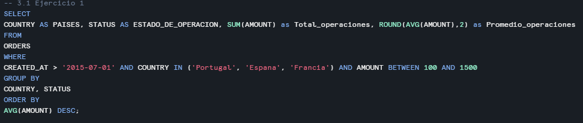
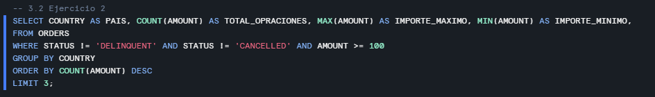
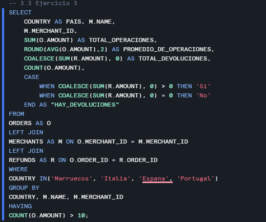
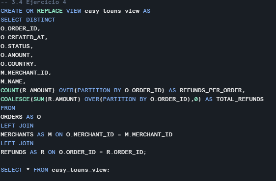
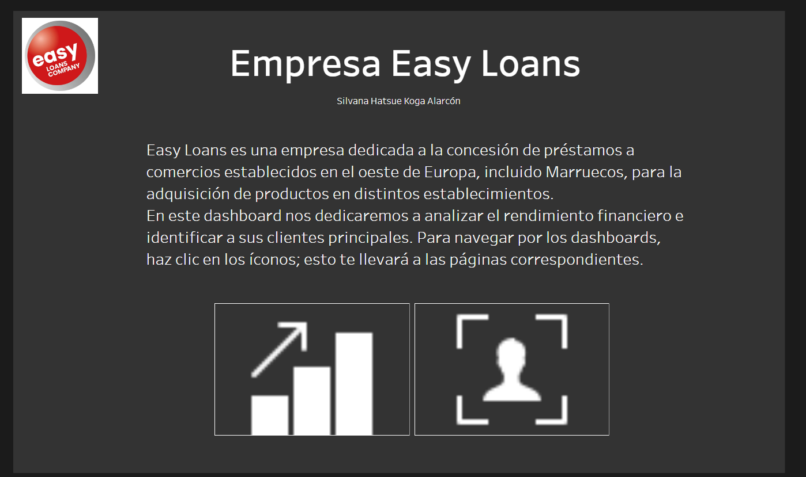
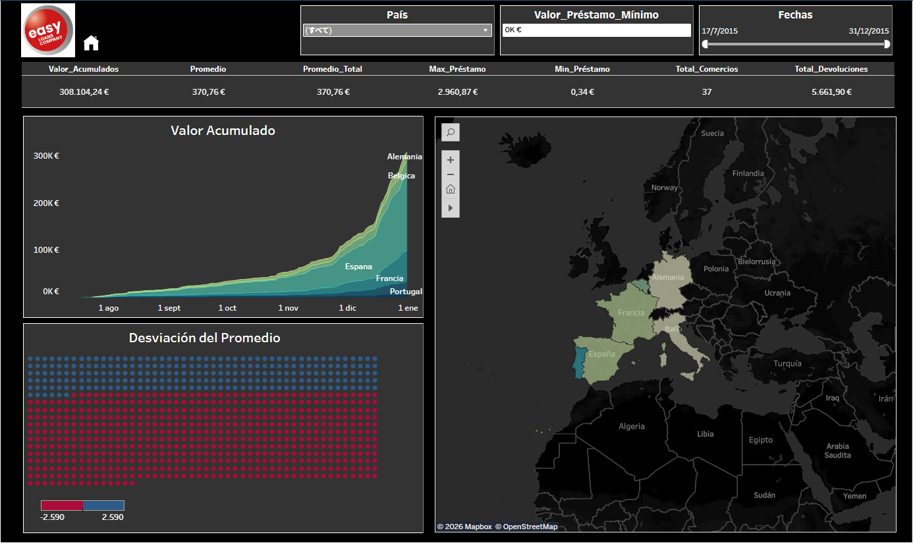
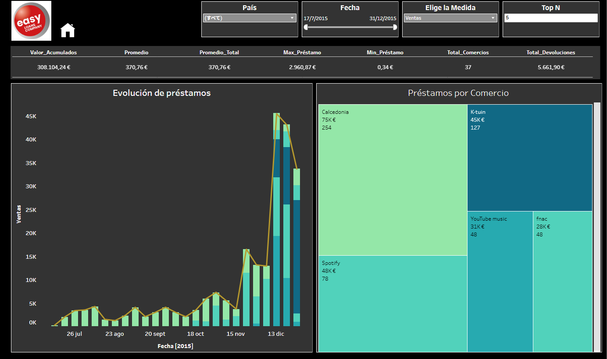
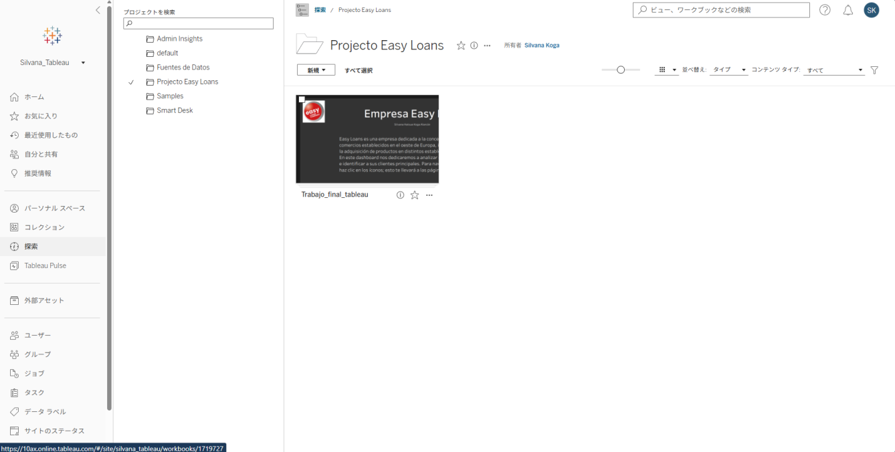
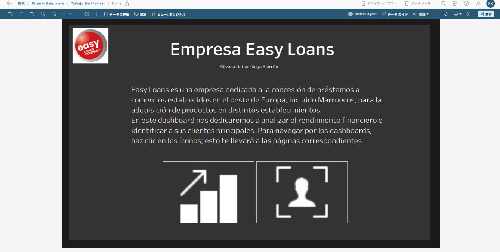

# Easy Loans Company
## Informe Final - Caso Práctico Easy Loans

**Autor:** Silvana Hatsue Koga Alarcón  
**Fecha:** 25 de enero  

---

## Tabla de Contenidos

1. [Introducción](#introducción)
2. [Consultas SQL](#consultas-sql)
   - [Ejercicio 1](#ejercicio-1)
     - [España](#españa)
     - [Portugal](#portugal)
     - [Francia](#francia)
   - [Ejercicio 2](#ejercicio-2)
   - [Ejercicio 3](#ejercicio-3)
   - [Ejercicio 4](#ejercicio-4)
3. [Dashboards](#dashboards)
   - [Home](#home)
   - [Dashboards (Rendimiento financiero)](#dashboards-rendimiento-financiero)
     - [Tabla KPI](#tabla-kpi)
     - [Mapa](#mapa)
     - [Gráfico de área](#gráfico-de-área)
     - [Vista de desviación](#vista-de-desviación)
     - [Filtros (Dashboard rendimiento financiero)](#filtros-dashboard-rendimiento-financiero)
   - [Dashboards (Análisis de clientes)](#dashboards-análisis-de-clientes)
     - [Gráfico combinado](#gráfico-combinado)
     - [Treemap](#treemap)
4. [Publicación de Dashboard a Tableau Cloud](#publicación-de-dashboard-a-tableau-cloud)

---

## Introducción

Easy Loans es una empresa dedicada a la concesión de préstamos a comercios establecidos en el oeste de Europa, incluido Marruecos, para la adquisición de productos en distintos establecimientos.

Este informe tiene como objetivo presentar métricas, mediante SQL, y visualizaciones de Tableau para identificar oportunidades y retos a partir de los indicadores clave en el contexto de Europa, sirviendo como estrategia para un mejor posicionamiento en el mercado europeo.

---

## Consultas SQL

### Ejercicio 1.

#### España
Al ver la respuesta a la consulta, vemos que en España el porcentaje del total de préstamos con el estado "Delinquent" es el segundo más alto, después de "Active". Habiendo más impagos que préstamos pagados, resulta preocupante, ya que el negocio podría perder liquidez, lo que reduce la solvencia y la flexibilidad para conceder créditos en el futuro. También se incurriría en costes derivados de posibles juicios por mora.

#### Portugal
En Portugal no hay clientes morosos, y el porcentaje es mayor entre los clientes que han devuelto el préstamo y los que están devolviéndolo.

#### Francia
En Francia hay muchos comercios activamente pagando el préstamo, pero la tasa de “Closed” es baja comparado a la de morosos (Delinquent).

---

### Ejercicio 2.

Los resultados de las consultas señalan que España, Francia e Italia son los países con más operaciones de préstamos. Sin embargo, podemos apreciar que en España se conceden significativamente más préstamos que los otros dos países.

---

### Ejercicio 3.

Aquí empezamos a ver que aun que España tiene más devoluciones, comparado a Portugal, Italia, y Marruecos, también se debe a que ofrece más préstamos a comercios establecidos en España. Pero si comparamos los países con la ratio:

$$\frac{\text{Total Reembolso}}{\text{Total Operaciones}}$$

notamos que para Marruecos la ratio es más alta con un 10.07%, Italia un 8.84%, mientras que para España es solo el 1.33%. Esto significa que España tiene menos devoluciones que sus operaciones realizadas comparadas con Italia y Marruecos.

---

### Ejercicio 4.

Se creó una vista para conectar estos datos con Tableau.

---

## Dashboards

### Home

La página de navegación incluye una breve descripción de Easy Loans, junto con los botones de navegación, para que el usuario pueda acceder a los dashboards de “Rendimiento financiero” y “Evolución del cliente”.

---

### Dashboards (Rendimiento financiero)

#### Tabla KPI
Esta tabla muestra resúmenes de los indicadores clave de rendimiento de Easy Loans. El usuario puede notar fácilmente los valores máximos, mínimos, devoluciones, valores acumulados.

#### Mapa
Podemos visualizar los países según el promedio de préstamos que conceden, y los diferentes colores nos ayudan a identificar el país con el mayor promedio. Cuanto más oscuro sea el color, mayor será el valor.

#### Gráfico de área
Se muestra el valor acumulado del préstamo por país y por fecha, lo que nos permite identificar tendencias en el tiempo y filtrar por el país que necesitemos investigar.

#### Vista de desviación
La vista muestra los valores desviados del promedio. Los valores azules representan valores positivos, mientras que los rojos, negativos.

#### Filtros (Dashboard rendimiento financiero)
Los filtros de este dashboard permiten al usuario filtrar los visuales y obtener las respuestas que requiera para crear estrategias y mejorar el rendimiento empresarial. Se puede hacer un filtrado por país, por rango de fechas o por el valor mínimo que se considere.

---

### Dashboards (Análisis de clientes)

#### Gráfico combinado
Por un lado, se puede seguir el rendimiento del monto total del préstamo o la cantidad por el tiempo con el gráfico de líneas, mientras que con el de columnas es posible identificar la cantidad por comercio para cada fecha.

#### Treemap
Describe la cantidad monetaria y el volumen de los préstamos. Se le asigna un color a cada comercio y la cantidad se reflejará en el área del cuadrado correspondiente.

---

## Publicación de Dashboard a Tableau Cloud

**Link:** [Dashboard Easy Loans en Tableau Cloud](https://10ax.online.tableau.com/t/silvana_tableau/views/Trabajo_final_tableau/Home)

